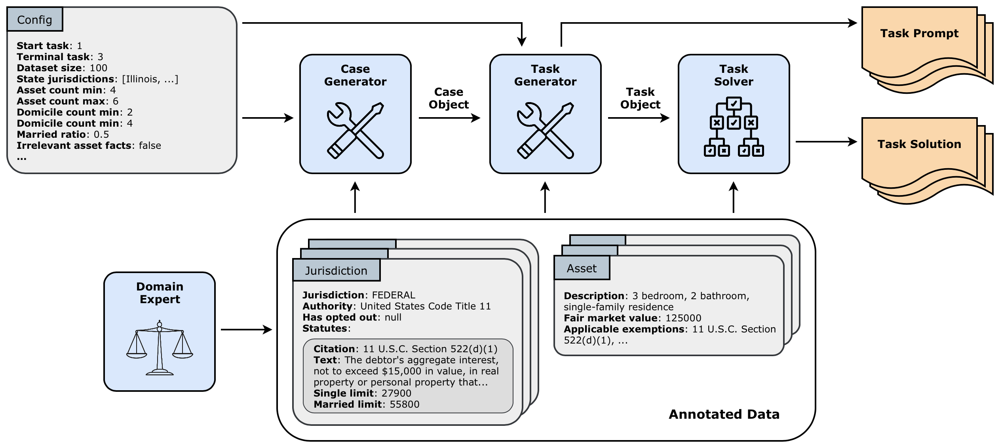

# OpenExempt
OpenExempt: A Diagnostic Benchmark for Legal Reasoning and a Framework for Creating Custom Benchmarks on Demand.

- [Read the paper]()

- [Access the benchmark](https://huggingface.co/datasets/SergioServantez/OpenExempt)

This work is licensed under [CC BY 4.0](https://creativecommons.org/licenses/by/4.0/)

Requires Python version 3.10 or later.

## OpenExempt Overview
OpenExempt is a framework and benchmark for diagnostic evaluation of legal reasoning capabilities in language models. The OpenExempt Framework is capable of creating complex legal reasoning tasks on demand, where each task scenario is dynamically shaped by the user through configuration settings. OpenExempt computes gold solutions for each task using expert-crafted symbolic representations of relevant U.S. federal and state statutes. Using this framework, we construct the [OpenExempt Benchmark](https://huggingface.co/datasets/SergioServantez/OpenExempt), a diagnostic benchmark with 9,765 samples across nine evaluation suites, designed to carefully probe model capabilities through controlled task variation. 

## OpenExempt Framework

This repo contains the OpenExempt Framework, a dynamic task generation system that creates complex legal reasoning benchmarks in the domain of U.S. bankruptcy and state exemption laws. This framework consists of three primary components: 1) a knowledge representation layer that encodes expert legal annotations; 2) a task generator that constructs paired representations in both symbolic and natural language forms; and 3) a deterministic solver that computes ground truth solutions using branch and bound optimization.



## OpenExempt Tasks

OpenExempt is composed of five tasks, with a total of 15 task variants, that mirror the sequence of legal reasoning steps a debtor’s attorney performs when protecting assets in bankruptcy. For each task, the model receives a fact pattern detailing the debtor's situation, which may include asset disclosures and residential history, along with a corpus of relevant federal and state laws. We describe each task below:

- **Task AE (Allowable Exemptions):** Before exemptions can be claimed, the Bankruptcy Code requires first understanding which state or federal exemptions are available to the Debtor. This task involves applying the multi-step "730-day Rule" to the Debtor's residency history to identify the applicable exemption jurisdictions, while accounting for state opt-out provisions.
- **Task EC (Exemption Classification):** Once the allowed exemption jurisdictions have been identified, each asset must be matched to the categories of exempt property defined by statute. This task requires rule-based reasoning to determine if a given asset satisfies the exemption antecedent, the specific property category defined by the statute.
- **Task EV (Exemption Valuation):** Exemptions are typically limited to a fixed dollar amount defined by the statute. This task requires not only identifying applicable exemptions, but also applying these statutory caps to calculate the maximum protectable dollar value for each asset under each of its available exemptions.
- **Task NA (Non-exempt Assets):** This task requires strategically allocating exemptions to determine the minimal total dollar value of non-exempt assets after applying all applicable exemptions, for each allowable exemption jurisdiction.
- **Task OE (Optimal Exemptions):** This task requires articulating the complete, optimal strategy to achieve the best outcome from Task NA. This requires selecting the allowable exemption jurisdiction that minimizes non-exempt asset value, and generating the explicit exemption schedule for that optimal jurisdiction.

**Task Variants**. Since OpenExempt tasks form a sequence, solving any given task depends on the successful completion of its predecessors. The OpenExempt framework allows users to configure which earlier steps are already solved and provided in the task prompt. This creates a family of task variants, where a task can be presented in its vanilla form (no prior steps solved) or with some or all preceding steps solved by the framework.

## Getting Started
Clone the repo:

```bash
git clone https://github.com/servantez/OpenExempt.git
```

Navigate to project directory:

```bash
cd OpenExempt
```

Install dependencies:

```bash
pip install -r requirements.txt
```

Run the framework:

```bash
python open_exempt.py -d dataset_name
```
Replace `dataset_name` with your preferred name. You can also specify two optional arguments: `-c` to specify the path to your config file (if you are not using the default), and the `-v` flag for verbose logging. This command will construct a dataset based on the settings in your config file, and output the dataset to the `/data/tasks/` directory. See below for details on setting the config file.

## Configuration Parameters

Framework users are able to control the legal tasks constructed in the dataset by setting a range of parameters in the config file. The default configuration file is located at config.json in the project root directory. The table below provides an overview of OpenExempt's configuration parameters.

| Parameter(s) | Description |
|:------------|:-------------|
| *start\_task\_id*, *terminal\_task\_id* | The process of exempting assets under the Bankruptcy Code proceeds through a fixed sequence of intermediate tasks. These configuration parameters specify which portion of that sequence the model is responsible for solving. *start\_task\_id* marks the first task to be solved, and *terminal\_task\_id* marks the last. When both are set to the same value (e.g., 3-3), the configuration isolates a single reasoning task; when set to the broadest range (e.g., 1-5), it evaluates the entire exemption process. This design enables fine-grained analysis of how performance changes as cumulative reasoning complexity increases. |
| *dataset\_size* | Specifies the number of unique tasks, and their corresponding ground-truth solutions, to generate under the given configuration. Each task is independently sampled using the specified asset ranges, jurisdictions, obfuscation settings, and all other configuration parameters. |
| *asset\_count\_min*, *asset\_count\_max* | Defines the minimum and maximum number of assets to include in each generated task. The actual asset count is sampled uniformly across this range, ensuring an equal distribution of tasks at each asset count. This allows controlled variation in task complexity across the dataset. |
| *married\_ratio* | Specifies the proportion of generated tasks that involve married debtors. Marital status affects applicable exemption limits in many jurisdictions. |
| *domicile\_count\_min*, *domicile\_count\_max* | The minimum and maximum number of prior domiciles to include in each fact pattern, sampled uniformly across the specified range. Domicile history determines which federal and state exemption laws a Debtor is eligible to claim. |
| *state\_jurisdictions* | Specifies the set of U.S. state jurisdictions used for task generation. For each task, one jurisdiction is sampled uniformly from this list to serve as the Debtor’s allowable exemption jurisdiction. The exemption statutes for all listed jurisdictions are included in the prompt, requiring the model to identify the correct jurisdiction and apply its exemption laws to the facts. |
| *irrelevant\_asset\_facts*, *irrelevant\_domicile\_facts*, *asset\_opinions*, *domicile\_opinions* | Boolean parameters that control the inclusion of obfuscating information in the fact pattern. When enabled, the benchmark injects legally immaterial details or subjective statements related to assets or domicile history. These parameters are used to evaluate the model's robustness to distraction, misdirection, and sycophancy by testing its ability to disregard extraneous details while applying the correct legal reasoning. |
| *data\_directory*, *asset\_directory*, *statute\_directory*, *template\_directory*, *output\_directory* | File path parameters that specify where the framework loads input resources and saves generated outputs. The input directories point to data dependencies required for task generation (annotated assets, exemption statutes, natural-language templates), while *output\_directory* designates where generated tasks and solutions are written.